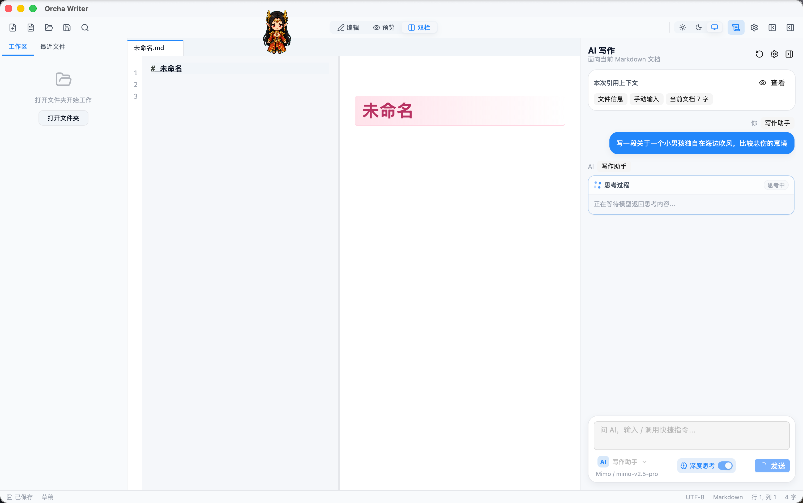
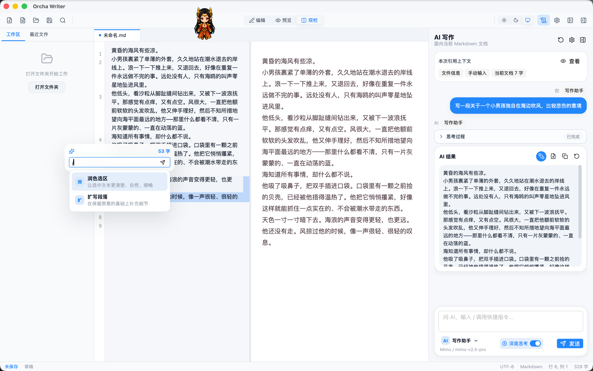
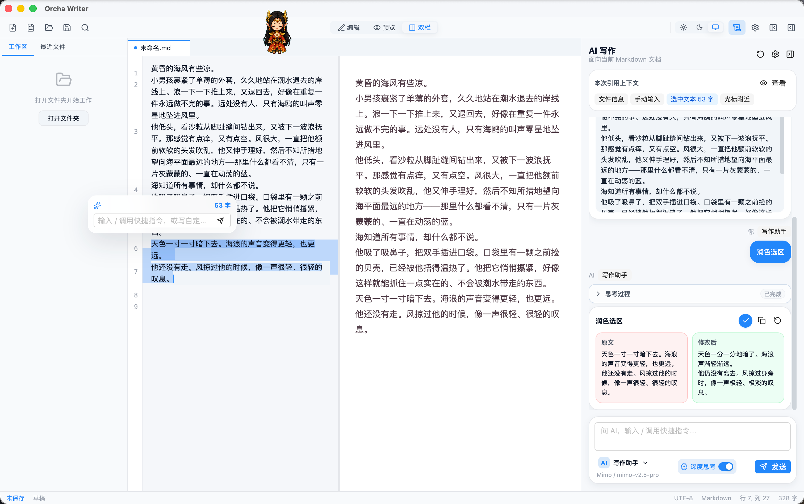
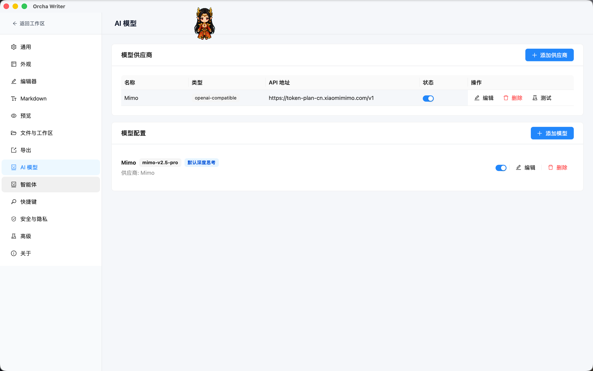

<p align="center">
  <picture>
    <source media="(prefers-color-scheme: dark)" srcset="src/assets/brand/orcha-writer-readme-logo-dark.svg" />
    
  </picture>
</p>

# Orcha Writer

Orcha Writer（Orcha 写作）是一款本地优先的跨平台 Markdown 写作与文档管理工具，面向产品文档、技术文档、本地知识整理、长文写作和文档交付场景。

它基于 Tauri、React、TypeScript 和 CodeMirror 6 构建，重点放在本地文件工作流、清爽的 Markdown 编辑体验，以及可接入真实模型的 AI 写作辅助。

## 界面预览

### 主界面与 AI 写作面板

编辑器、实时预览、工作区和 AI 写作面板可以同时协作。AI 面板会读取当前文档、选中文本或手动输入作为上下文。

<p>
  
</p>

### AI 生成结果

AI 回复支持思考过程、结果卡片、复制、重新生成、插入文档、新建文档等操作。深度思考开启后，模型返回的思考内容会单独展示，并在完成后默认折叠。

<p>
  
</p>

### 选区快捷指令与差异结果

选中文本后可以直接调用快捷指令，例如润色、扩写、翻译、摘要等。需要修改原文时，结果会以差异卡片展示，方便确认后再应用。

<p>
  
</p>

### AI 模型配置

支持配置 OpenAI-compatible 等模型供应商，模型可以设置温度、最大 Tokens、深度思考开关和思考预算。

<p>
  
</p>

## 核心能力

- 本地 Markdown 文档编辑与手动保存
- 文件夹工作区、最近文件、多标签文档管理
- 编辑、预览、双栏三种视图模式
- Markdown 实时预览、滚动同步、代码高亮和目录支持
- 粘贴图片本地化保存，支持文档相对路径
- PDF / HTML 导出，可配置导出目录和覆盖策略
- 工作区、大纲、AI 面板等区域可按需收起
- 主题、编辑器、预览、导出、快捷键、安全等设置项

## AI 写作

Orcha Writer 的 AI 模块围绕当前 Markdown 文档设计，不是一个孤立聊天框：

- 支持写作助手、润色、扩写、翻译、摘要等智能体和快捷指令
- 支持通过 `/` 在输入框中调用指令
- 支持选中文本后的浮层快捷操作
- 支持结果卡片操作：应用修改、插入光标处、新建文档、复制、重新生成
- 支持 OpenAI-compatible 模型配置
- 支持深度思考开关、思考预算和思考过程展示
- 支持会话自动滚动，同时避免流式或长内容生成时打断用户手动滚动

## 适用场景

- 产品说明、需求文档、交互说明
- README、API 文档、部署文档、架构说明
- 本地笔记、会议纪要、学习记录
- 长文草稿、故事片段、创意写作
- Markdown 文档转 PDF / HTML 后对外交付

## 技术栈

- Tauri 2
- React 19
- TypeScript
- Vite
- CodeMirror 6
- Ant Design
- markdown-it
- Zustand

## 开发环境

需要安装：

- Node.js LTS
- pnpm
- Rust stable
- Tauri 2 所需系统依赖

安装依赖：

```bash
pnpm install
```

启动前端开发服务：

```bash
pnpm dev
```

启动 Tauri 开发模式：

```bash
pnpm tauri:dev
```

## 构建

前端构建：

```bash
pnpm build
```

桌面应用打包：

```bash
pnpm tauri:build
```

macOS 本地构建产物通常位于：

```text
src-tauri/target/release/bundle/
```

## 自动发版

仓库已配置 GitHub Actions 自动发版。推送 `v*` tag 后会构建 Release 并上传安装包：

```bash
# 1. 更新 CHANGELOG.md 中对应版本的条目
# 2. 只更新 package.json 的 version，然后运行 pnpm version:sync
# 3. 提交后打 tag 并推送
git tag v0.1.0
git push origin v0.1.0
```

版本号以 `package.json` 为唯一源头。`pnpm version:sync` 会同步
`src-tauri/tauri.conf.json`、`src-tauri/Cargo.toml` 和 `src-tauri/Cargo.lock`；
`pnpm tauri` / `pnpm tauri:build` 也会在打包前自动执行同步。

当前 Release workflow 会构建：

- macOS Intel：`.app` / `.dmg`
- macOS Apple Silicon：`.app` / `.dmg`
- Windows x64：NSIS 安装包
- Linux x64：AppImage / deb

## 自动更新

应用使用 Tauri Updater 检查 GitHub Release 中的 `latest.json`，支持在应用内下载并安装更新。
发布包会在 CI 中生成 updater artifacts、`.sig` 签名和 `latest.json`。

自动更新依赖 Tauri updater 签名密钥：

- 公钥写在 `src-tauri/tauri.conf.json`，可以提交到仓库。
- 私钥必须放在 GitHub Secrets 的 `TAURI_SIGNING_PRIVATE_KEY` 中，不能提交到仓库。
- 如果私钥设置了密码，还需要配置 `TAURI_SIGNING_PRIVATE_KEY_PASSWORD`。
- 本地打包更新包时，可以把私钥路径导出为 `TAURI_SIGNING_PRIVATE_KEY_PATH`。

私钥丢失后，已安装旧版本的用户将无法继续通过自动更新升级；如需轮换密钥，需要重新生成密钥并同步更新配置中的公钥。

## macOS 首次打开

当前开源版本暂未接入 Apple Developer ID 签名与公证，macOS 可能会提示“Orcha Writer 已损坏，无法打开”。下载包本身不是损坏，通常是系统给从网络下载的应用加了隔离标记。

处理方式：

1. 下载对应架构的 `.dmg`：
   - Apple Silicon（M1 / M2 / M3 / M4）：`aarch64.dmg`
   - Intel：`x64.dmg`
2. 打开 `.dmg`，把 `Orcha Writer.app` 拖到“应用程序”。
3. 打开“终端”，执行：

```bash
xattr -dr com.apple.quarantine "/Applications/Orcha Writer.app"
```

如果提示权限不足，再执行：

```bash
sudo xattr -dr com.apple.quarantine "/Applications/Orcha Writer.app"
```

然后从“应用程序”里重新打开 Orcha Writer。

## 仓库地址

https://github.com/orcha-ai/orcha-writer

## 开源协议

本项目采用 MIT 开源协议，详见 [LICENSE](LICENSE)。

版权与贡献：Orcha AI 团队出品。
